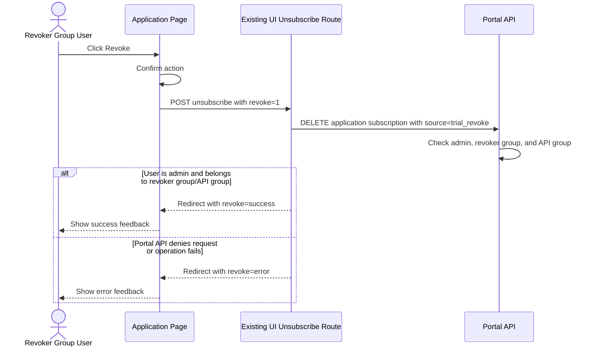
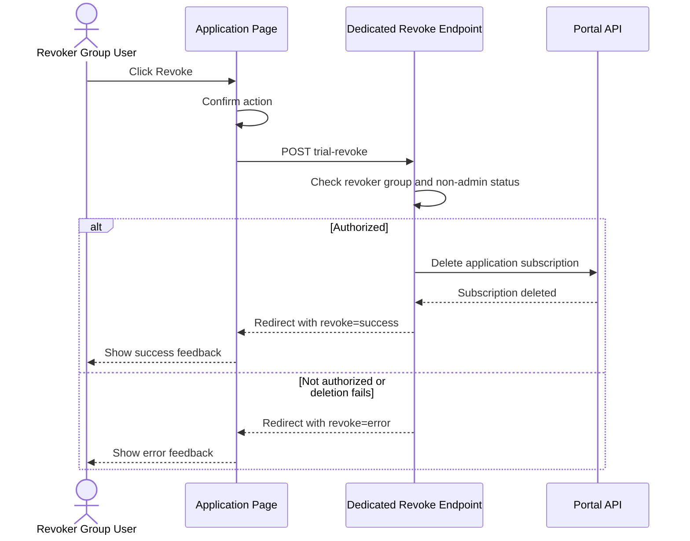

# Trial Revoke POC (Revoker Group)

## Goal

Provide a one-click revoke action for trial subscriptions from the Application page.

This document describes the implemented **Revoke** button on the application details page and the alternative revoke-only endpoint approach. The implemented button removes the selected API subscription and invalidates its API key.

## Scope

In scope:

- Manual one-click trial revoke
- UI visibility control by admin, revoker group, and API group
- Existing Wicked subscription deletion behavior
- Success/error feedback after the action

Out of scope:

- Automatic/scheduled trial expiry
- New background jobs
- Changes to existing key rotation / key expiry behavior

## Product Manager Summary

Both approaches give a permitted product manager a one-click **Revoke** button on an application's subscription. After confirmation, the application is unsubscribed and the API key stops working.

| Topic | Approach 1: Implemented Admin Revoker Group | Approach 2: Dedicated Revoke-Only Endpoint |
| --- | --- | --- |
| User experience | One-click Revoke button on the application page | One-click Revoke button |
| API key after revoke | No longer works | No longer works |
| Access given to revoker | Revoke plus admin-level portal capabilities | Revoke capability only |
| New backend API endpoint | No | Yes |
| Delivery effort | Lower | Higher |
| Security isolation | Lower, because admin rights are broader | Higher, because permission is revoke-only |
| Best fit | POC or where admin revoker access is acceptable | Production use where least-privilege access is required |

### Decision Points

Discuss these points with the product manager before selecting an approach:

1. Can a Revoker Group user also have admin rights? If yes, use Approach 1.
2. Must a Revoker Group user be limited to revoking trial access only? If yes, use Approach 2.
3. Is a quick proof of concept needed first? If yes, use Approach 1.
4. Is a new backend endpoint, automated test coverage, audit event design, and ongoing maintenance acceptable? If yes, Approach 2 can provide stricter access control.

## Approach 1: Implemented Admin Revoker Group

Use a dedicated Revoker Group together with normal admin access. The Revoke button calls the existing unsubscribe route, which then uses the existing Portal API delete subscription endpoint.

- User must belong to the revoker group
- User must be an admin
- User must be allowed to manage the selected API group
- The revoker group does not need to be an admin group if the user is also assigned to a separate admin group

The button is hidden unless these rules are met. The Portal API delete path also checks the revoker rule when the request is marked as a trial revoke.

### Configuration

Set the revoker group ID/name using one of the following:

1. `portalGlobals.revokerGroup` (preferred)
2. environment variable `REVOKER_GROUP`

There is no default fallback group. If neither setting is provided, the Revoke action stays disabled/hidden for all users.

Define the same group in the external wicked-config `groups.json` configuration, for example:

```json
{
	"id": "revoke",
	"name": "Revoker Subscription User Group",
	"adminGroup": false,
	"approverGroup": false
}
```

Assign the group ID to each intended revoker in the user's stored `groups` array. The same user must also be an admin, either through a separate admin group or because the revoker group itself is configured with `adminGroup: true`. If the identity provider sends an external group such as an ADFS group, map it through `alt_ids`, but configure `revokerGroup` with the Wicked group `id`.

### Implementation

UI:

- File: `src/ui/views/application.pug`
- Adds a `Revoke` button in the Subscriptions table for approved key-auth subscriptions
- Button is rendered when `sub.canTrialRevoke` is true
- Shows success/error feedback from the `revoke` query parameter

Server route (existing UI service route):

- File: `src/ui/routes/applications.js`
- Loads the logged-in user's full user record from `/users/:userId`
- Computes `sub.canTrialRevoke` for each subscription row
- Existing endpoint: `POST /applications/:appId/unsubscribe/:apiId`
- The Revoke button calls it with `?revoke=1` to return to the application page with feedback
- The route calls the existing Portal API deletion endpoint: `DELETE /applications/:appId/subscriptions/:apiId?source=trial_revoke`
- Existing Unsubscribe buttons do not pass `revoke=1`, so their current redirect behavior is unchanged

The implemented visibility rule is:

```text
req.user.admin === true
AND userInfo.groups includes configured revokerGroup
AND API is public/partner OR userInfo.groups includes api.requiredGroup
```

The backend applies the same revoker check only when `source=trial_revoke` is present. Normal subscription deletion keeps the existing Wicked authorization rules.

### Sequence Diagram



### Benefits and Limitation

- Reuses existing Wicked authorization and subscription deletion behavior
- Does not require a new backend API endpoint
- Does not require temporary application ownership changes
- Revoker users must also have admin rights, so this is not least-privilege authorization
- The revoker-group and API-group checks are enforced in both the UI visibility rule and the backend delete path when `source=trial_revoke` is present

### Product Manager Explanation

Choose this when speed and low implementation effort are more important than a fully separate permission model. Revoker users must also be admins, so they can revoke a trial in one click but also have broader admin capabilities. This is the implemented POC option.

## Approach 2: Dedicated Revoke-Only Endpoint

Create a dedicated Portal API endpoint for the Revoker Group. The endpoint must validate that the caller belongs to the configured revoker group and is not an admin, then delete the selected subscription using server-side authorization.

Do not implement this approach by adding the user as a temporary owner. Existing owner creation requires owner/admin access, so a regular revoker cannot add themselves as an owner.

### Configuration

- Define a dedicated Revoker Group in `groups.json`
- Configure the group ID through `portalGlobals.revokerGroup` or `REVOKER_GROUP`
- Assign the group ID to intended revokers in their stored `groups` array
- Do not set `adminGroup: true` or `approverGroup: true` for this approach

### Implementation

- Add a new protected endpoint, for example: `POST /applications/:appId/subscriptions/:apiId/trial-revoke`
- The UI Revoke button calls this endpoint
- The endpoint checks the configured group and rejects admins
- The endpoint deletes the subscription directly through the server-side subscription service/DAO
- The endpoint emits an audit/webhook event for the revocation

### Sequence Diagram



### Benefits and Limitation

- Gives the Revoker Group only the revoke permission required by this feature
- Avoids granting general approver privileges
- Requires new Portal API authorization logic, implementation, tests, audit handling, and maintenance

### Product Manager Explanation

Choose this when the business requires strict separation of duties. Revoker Group users can revoke trial subscriptions but cannot gain general approver permissions. This gives the smallest required permission set, but needs additional backend delivery and long-term ownership.

## Feedback

- Redirect query `?revoke=success` -> success alert on application page
- Redirect query `?revoke=error` -> error alert on application page

## Expected Behavior

After successful revoke:

- The selected subscription is removed from the application
- Corresponding API key is no longer usable because subscription no longer exists
- Only the selected API subscription is deleted; other subscriptions for the same application remain unchanged
- The user is redirected back to the application page and sees success feedback

## Related Access: API Page All Subscriptions

On the API details page, the **All Subscriptions** panel is admin-only.

- The UI renders the panel only when `authUser.admin` is true.
- The UI route only fetches `/apis/:apiId/subscriptions` when `req.user.admin` is true.
- The backend also rejects this API-specific subscription list unless the user is an admin.
- `admin` is derived from group membership where the group has `adminGroup: true`.

Approvers can access some subscription administration pages, but they cannot see the API page's **All Subscriptions (Admin only)** section unless they are also admins. A superadmin can see it because the `api-admin` group is treated as an admin group.

### Navigation From API Subscription List

The **All Subscriptions** panel lists every application currently subscribed to the selected API. Each application entry links to that application's details page.

The current implementation does not add a Revoke button inside the API page's **All Subscriptions** panel. The user clicks an application from that list, lands on the application details page, and can revoke the matching subscription there when `sub.canTrialRevoke` is true.

## Notes

- Existing flows for Rotate Key and Expire Key remain unchanged.
- Approach 1 is the current implementation and is recommended for a quick POC because it reuses existing Wicked capabilities.
- Approach 2 is recommended when production requirements demand revoke-only authorization.
